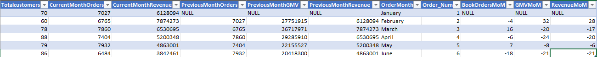
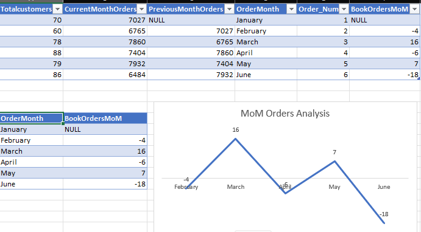
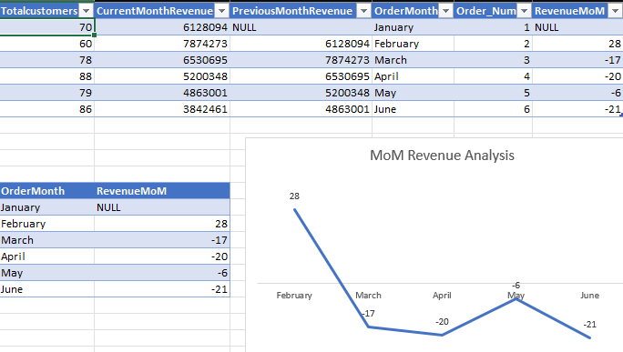
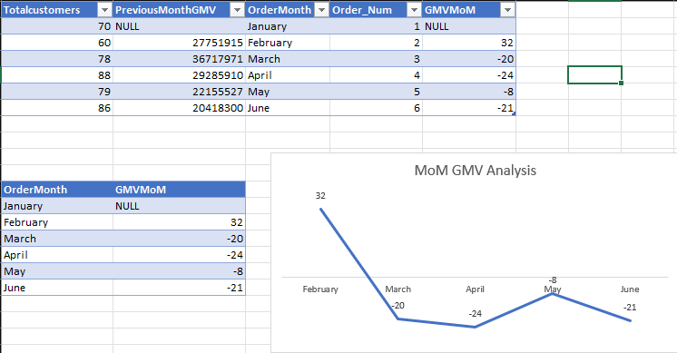

# GrowthRate Overview

## Introduction
The above growth rate exploratory data analytics is peformed to track logistics customer orders, revenue and delivery fee monthly performance
however, identify the strength and weakness of the business over a period of time. the descriptive analytics drive to impact insights and recommendation
for effective and informed decision making

## TotalOrders MoM Exploratory Data Analytics

## Orders Performance
the total orders descriptive analytics indicated the performance of our orders between january to june. 
the most total orders booked by customers was the month of may down to the least month

## Revenue MoM Exploratory Data Analytics

## Revenue Performance
the total revenue descriptive analytics indicated revenue performance between january to june. the month with the most
revenue generation was march down to the least month

## GMV MoM Exploratory Data Analytics 

## GMV Performance 
the total gmv descriptive analytics indicated Gmv performance between january to june. the month with the most
gross merchandise value is march down to the least month

## Technology used
for the purpose of the problem statement and complexity of the data, the modern data stack used is sql.
the query optimization technques that was used for execution plan is SUBQUERY

## insights and Recommendation
the Descriptive analytics shows our customers patterns and behaviours on how they patronise our services.
we must take cognisance of this buying patterns to aviod future occurences and improve our service to boost our order volumes
which may likely impact our internal revenue

## Conclusions
the project demonstrated a logistics company performance over a period of time and tells a story that we make us take
full responsibility of our respective duties and showcase our strength and weakness

